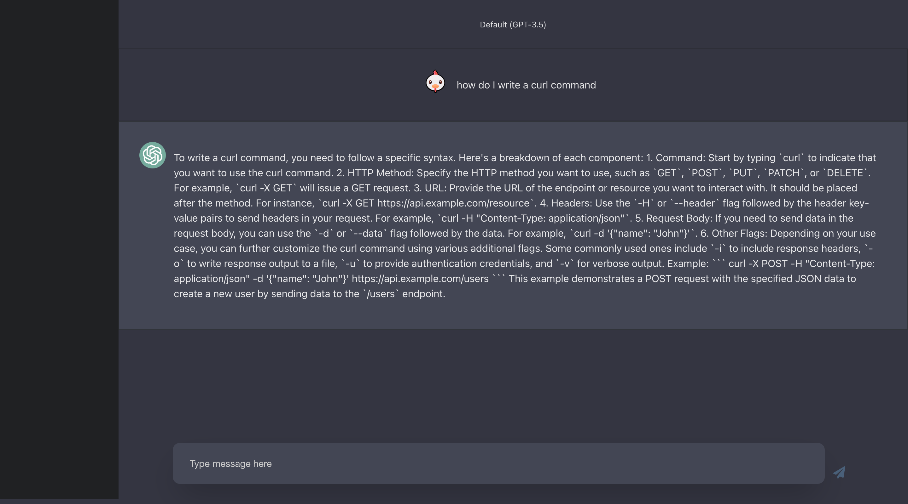

<a name="readme-top"></a>

<!-- PROJECT SHIELDS -->
<!--
*** I'm using markdown "reference style" links for readability.
*** Reference links are enclosed in brackets [ ] instead of parentheses ( ).
*** See the bottom of this document for the declaration of the reference variables
*** for contributors-url, forks-url, etc. This is an optional, concise syntax you may use.
*** https://www.markdownguide.org/basic-syntax/#reference-style-links
-->
<!-- [![Contributors][contributors-shield]][contributors-url]
 -->
[![Forks][forks-shield]][forks-url]
[![Stargazers][stars-shield]][stars-url]
[![Issues][issues-shield]][issues-url]
[![LinkedIn][linkedin-shield]][linkedin-url]

<!-- PROJECT LOGO -->
<br />
<div align="center">
  <a href="https://github.com/micurran/gpt-react-clone">
    
  </a>
  <a href="https://github.com/micurran/gpt-react-clone">
    
  </a>
  <h3 align="center">GPT-React Clone</h3>

  <p align="center">
    A ChatGPT clone built with React
    <br />
    <a href="https://github.com/MiCurran/gpt-react-clone"><strong>Explore the docs »</strong></a>
    <br />
    <br />
    <a href="https://gpt-react-clone.vercel.app/">View Demo</a>
    ·
    <a href="https://github.com/MiCurran/gpt-react-clone/issues">Report Bug</a>
    ·
    <a href="https://github.com/MiCurran/gpt-react-clone/issues">Request Feature</a>
  </p>
</div>


<!-- TABLE OF CONTENTS -->
<details>
  <summary>Table of Contents</summary>
  <ol>
    <li>
      <a href="#about-the-project">About The Project</a>
      <ul>
        <li><a href="#built-with">Built With</a></li>
      </ul>
    </li>
    <li>
      <a href="#getting-started">Getting Started</a>
      <ul>
        <li><a href="#prerequisites">Prerequisites</a></li>
        <li><a href="#installation">Installation</a></li>
      </ul>
    </li>
    <li><a href="#roadmap">Roadmap</a></li>
    <li><a href="#contributing">Contributing</a></li>
    <li><a href="#contact">Contact</a></li>
  </ol>
</details>


<!-- ABOUT THE PROJECT -->
## About The Project
<p>This is meant to be an easy to use jumping off point for using OpenAI's chat endpoints.
If you have a suggestion that would make this better, please fork the repo and create a pull request. You can also simply open an issue with the tag "enhancement". Don't forget to give the project a star! Thanks!
</p>
  

<p align="right">(<a href="#readme-top">back to top</a>)</p>


### Built With


[![React][React.js]][React-url]

<p align="right">(<a href="#readme-top">back to top</a>)</p>


<!-- GETTING STARTED -->
## Getting Started

This is meant to be an easy to use jumping off point for using OpenAI's chat endpoints.  Contributions welcome!
Follow the instructions below to get started.

### Prerequisites

This is an example of how to list things you need to use the software and how to install them.
* npm
  ```sh
  npm install npm@latest -g
  ```

### Installation

1. Get an API Key at [https://openai.com/blog/openai-api](https://openai.com/blog/openai-api)
2. Clone the repo
   ```sh
   git clone https://github.com/MiCurran/gpt-react-clone
   ```
3. Navigate into the rep
   ```sh
   cd gpt-react-clone
   ```
4. Install NPM packages
   ```sh
   npm install
   ```
5. Enter your API in `.env`
   ```
   GPT_API_KEY=ENTER YOUR API;
   ```

<p align="right">(<a href="#readme-top">back to top</a>)</p>


<!-- ROADMAP -->
## Roadmap

- [x] Send request on default question click
- [ ] Add more default questions
- [ ] Add New Chat Button
- [ ] Add Conversations
- [ ] Add Code view
- [ ] OAuth


See the [open issues](https://github.com/MiCurran/gpt-react-clone/issues) for a full list of proposed features (and known issues).

<p align="right">(<a href="#readme-top">back to top</a>)</p>


<!-- CONTRIBUTING -->
## Contributing

Contributions are what make the open source community such an amazing place to learn, inspire, and create. Any contributions you make are **greatly appreciated**.

If you have a suggestion that would make this better, please fork the repo and create a pull request. You can also simply open an issue with the tag "enhancement".
Don't forget to give the project a star! Thanks again!

1. Fork the Project
2. Create your Feature Branch (`git checkout -b feature/AmazingFeature`)
3. Commit your Changes (`git commit -m 'Add some AmazingFeature'`)
4. Push to the Branch (`git push origin feature/AmazingFeature`)
5. Open a Pull Request

<p align="right">(<a href="#readme-top">back to top</a>)</p>


<!-- CONTACT -->
## Contact


Project Link: [https://github.com/MiCurran/gpt-react-clone](https://github.com/MiCurran/gpt-react-clone)

<p align="right">(<a href="#readme-top">back to top</a>)</p>


<!-- Use this space to list resources you find helpful and would like to give credit to. I've included a few of my favorites to kick things off!

* [Choose an Open Source License](https://choosealicense.com)
* [GitHub Emoji Cheat Sheet](https://www.webpagefx.com/tools/emoji-cheat-sheet)
* [Malven's Flexbox Cheatsheet](https://flexbox.malven.co/)
* [Malven's Grid Cheatsheet](https://grid.malven.co/)
* [Img Shields](https://shields.io)
* [GitHub Pages](https://pages.github.com)
* [Font Awesome](https://fontawesome.com)
* [React Icons](https://react-icons.github.io/react-icons/search) -->

<p align="right">(<a href="#readme-top">back to top</a>)</p>


<!-- MARKDOWN LINKS & IMAGES -->
<!-- https://www.markdownguide.org/basic-syntax/#reference-style-links -->
[contributors-shield]: https://img.shields.io/github/contributors/MiCurran/Best-README-Template.svg?style=for-the-badge
[contributors-url]: https://github.com/MiCurran/gpt-react-clone/contributors
[forks-shield]: https://img.shields.io/github/forks/MiCurran/Best-README-Template.svg?style=for-the-badge
[forks-url]: https://github.com/MiCurran/gpt-react-clonenetwork/members
[stars-shield]: https://img.shields.io/github/stars/MiCurran/Best-README-Template.svg?style=for-the-badge
[stars-url]: https://github.com/MiCurran/gpt-react-clonestargazers
[issues-shield]: https://img.shields.io/github/issues/MiCurran/Best-README-Template.svg?style=for-the-badge
[issues-url]: https://github.com/MiCurran/gpt-react-cloneissues
[license-shield]: https://img.shields.io/github/license/MiCurran/Best-README-Template.svg?style=for-the-badge
[license-url]: https://github.com/MiCurran/gpt-react-cloneblob/master/LICENSE.txt
[linkedin-shield]: https://img.shields.io/badge/-LinkedIn-black.svg?style=for-the-badge&logo=linkedin&colorB=555
[linkedin-url]: https://linkedin.com/in/MiCurran
[product-screenshot]: images/screenshot.png
[Next.js]: https://img.shields.io/badge/next.js-000000?style=for-the-badge&logo=nextdotjs&logoColor=white
[Next-url]: https://nextjs.org/
[React.js]: https://img.shields.io/badge/React-20232A?style=for-the-badge&logo=react&logoColor=61DAFB
[React-url]: https://reactjs.org/
[Vue.js]: https://img.shields.io/badge/Vue.js-35495E?style=for-the-badge&logo=vuedotjs&logoColor=4FC08D
[Vue-url]: https://vuejs.org/
[Angular.io]: https://img.shields.io/badge/Angular-DD0031?style=for-the-badge&logo=angular&logoColor=white
[Angular-url]: https://angular.io/
[Svelte.dev]: https://img.shields.io/badge/Svelte-4A4A55?style=for-the-badge&logo=svelte&logoColor=FF3E00
[Svelte-url]: https://svelte.dev/
[Laravel.com]: https://img.shields.io/badge/Laravel-FF2D20?style=for-the-badge&logo=laravel&logoColor=white
[Laravel-url]: https://laravel.com
[Bootstrap.com]: https://img.shields.io/badge/Bootstrap-563D7C?style=for-the-badge&logo=bootstrap&logoColor=white
[Bootstrap-url]: https://getbootstrap.com
[JQuery.com]: https://img.shields.io/badge/jQuery-0769AD?style=for-the-badge&logo=jquery&logoColor=white
[JQuery-url]: https://jquery.com 